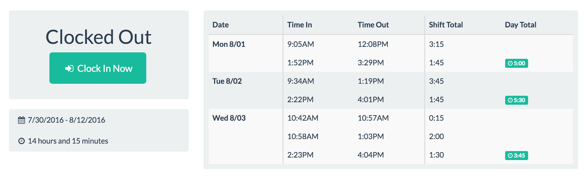

# Simple eTime for ADP

> **No Longer Under Development** - My employer has switched over to PeopleSoft, and Simple eTime
is no longer being developed. Feel free to fork it and run with it as you please, that's the beauty
of FOSS!

An example application to show off [adp-etime-api](http://github.com/therealgitcub/adp-etime-api)

## Disclaimer
ADP and Enterprise eTime are registered trademarks of ADP, LLC. ADP eTime 
API and Kobi Tate (TheRealGitCub) are NOT affiliated with ADP, LLC. This 
software is NOT associated with nor endorsed by ADP, LLC. Use of this API 
may violate ADP eTime terms and conditions. Developer assumes no 
responsibility for any repercussions from the use of the software. 
Use at your own risk.
